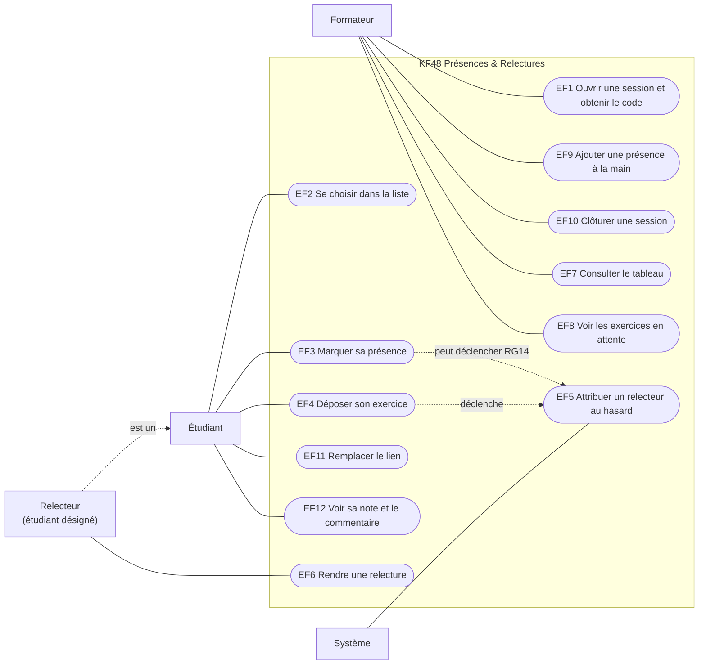

# D1 — Cas d'utilisation

Mermaid n'a pas de diagramme de cas d'utilisation natif : les acteurs sont en rectangles, les cas d'utilisation en ovales à l'intérieur du système.

Le relecteur n'est pas un acteur distinct : c'est un étudiant désigné sur une relecture (section 2 du cahier des charges).
