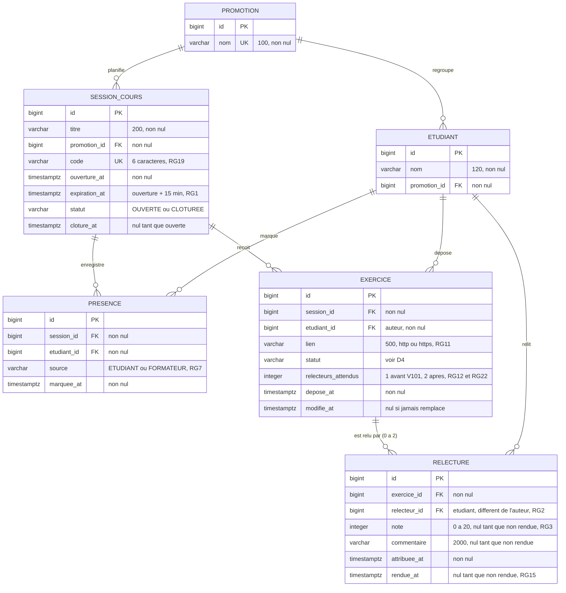

# D2 — Modèle de données (version 2)

Ce diagramme décrit le schéma obtenu après les migrations `V1__schema.sql` et `V101__deux_relecteurs.sql`. Il est mis à jour à chaque migration qui touche au schéma.

**Version 2 (étape 3) :** un exercice a désormais jusqu'à deux relectures, une par relecteur distinct. La colonne `relecteurs_attendus` distingue les exercices déposés avant le changement (1) de ceux déposés après (2).

**Contraintes non représentables dans le diagramme, présentes dans les migrations :**

| Table           | Contrainte                                                                                       | Règle      | Migration                                    |
| --------------- | ------------------------------------------------------------------------------------------------ | ---------- | -------------------------------------------- |
| `presence`      | `UNIQUE (session_id, etudiant_id)`                                                               | RG5        | V1                                           |
| `presence`      | `CHECK (source IN ('ETUDIANT','FORMATEUR'))`                                                     | RG7        | V1                                           |
| `exercice`      | `UNIQUE (session_id, etudiant_id)`                                                               | RG8        | V1                                           |
| `exercice`      | `CHECK (statut IN ('EN_ATTENTE_ATTRIBUTION','EN_ATTENTE_RELECTURE','RELU'))`                     | D4         | V1                                           |
| `exercice`      | `CHECK (relecteurs_attendus BETWEEN 1 AND 2)`                                                    | RG12, RG22 | V101                                         |
| `relecture`     | `UNIQUE (exercice_id, relecteur_id)` : un même relecteur ne relit pas deux fois le même exercice | RG12       | V101 (remplace `UNIQUE (exercice_id)` de V1) |
| `relecture`     | `CHECK (note BETWEEN 0 AND 20)`                                                                  | RG3        | V1                                           |
| `session_cours` | `CHECK (statut IN ('OUVERTE','CLOTUREE'))`                                                       | H1         | V1                                           |
| toutes          | index sur chaque clé étrangère                                                                   | ENF7       | V1                                           |

La table s'appelle `session_cours` et non `session`, parce que `SESSION` est un mot réservé dans certains moteurs SQL, dont H2 utilisé pour les tests.
