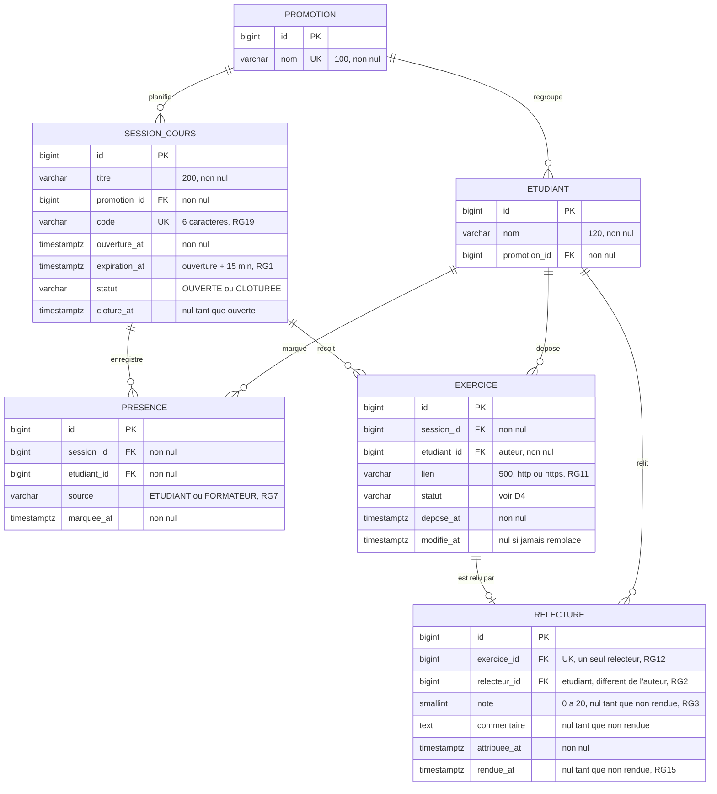

# D2 — Modèle de données

Ce diagramme décrit exactement la migration `backend/src/main/resources/db/migration/V1__schema.sql`. Toute nouvelle migration qui touche au schéma met ce fichier à jour dans le même commit.

**Contraintes non représentables dans le diagramme, présentes dans la migration :**

| Table           | Contrainte                                                                   | Règle |
| --------------- | ---------------------------------------------------------------------------- | ----- |
| `presence`      | `UNIQUE (session_id, etudiant_id)`                                           | RG5   |
| `presence`      | `CHECK (source IN ('ETUDIANT','FORMATEUR'))`                                 | RG7   |
| `exercice`      | `UNIQUE (session_id, etudiant_id)`                                           | RG8   |
| `exercice`      | `CHECK (statut IN ('EN_ATTENTE_ATTRIBUTION','EN_ATTENTE_RELECTURE','RELU'))` | D4    |
| `relecture`     | `UNIQUE (exercice_id)`                                                       | RG12  |
| `relecture`     | `CHECK (note BETWEEN 0 AND 20)`                                              | RG3   |
| `session_cours` | `CHECK (statut IN ('OUVERTE','CLOTUREE'))`                                   | H1    |
| toutes          | index sur chaque clé étrangère                                               | ENF7  |

La table s'appelle `session_cours` et non `session`, parce que `SESSION` est un mot réservé dans certains moteurs SQL, dont H2 utilisé pour les tests.
