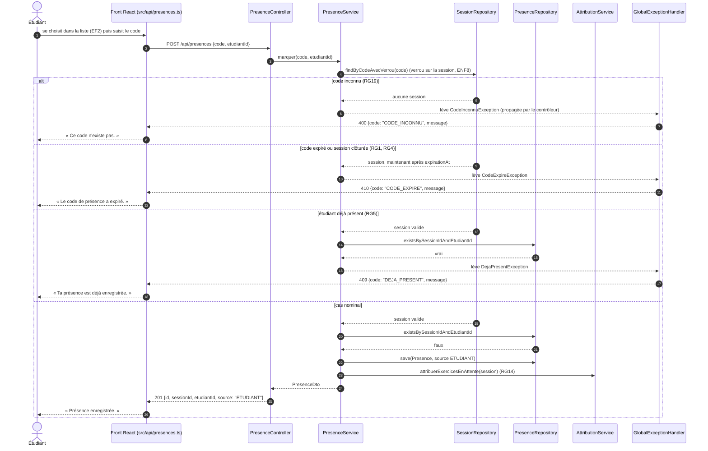

# D3 — Séquence : marquer sa présence

Correspond à `POST /api/presences` dans `api/contrat.yaml`. Les contrôles sont faits dans cet ordre : code inconnu, code expiré ou session clôturée, étudiant, déjà présent.

**Cas non détaillés dans le diagramme**, contrôlés entre l'expiration et le doublon : champ manquant (400 CHAMP_MANQUANT), étudiant inconnu (400 ETUDIANT_INCONNU) et étudiant d'une autre promotion (400 ETUDIANT_HORS_PROMOTION, RG6). L'enregistrement de la présence et l'attribution se font dans la même transaction.

**Depuis le correctif de l'issue #<B> :** la session est lue avec un verrou pessimiste (`SELECT ... FOR UPDATE`). Les marquages simultanés d'une même session sont traités l'un après l'autre. Avant ce correctif, deux marquages simultanés pouvaient tenter d'attribuer le même exercice en attente (RG14) ; l'un échouait et sa présence était perdue.
