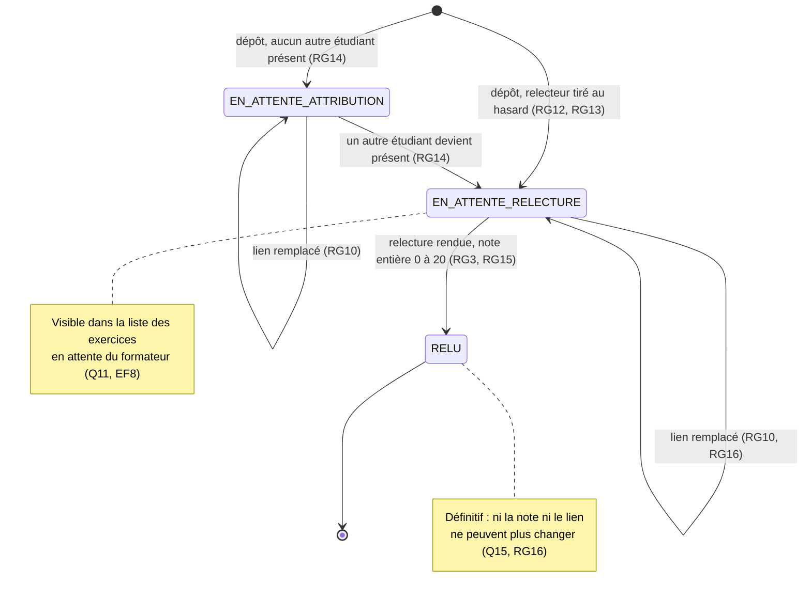

# D4 — Cycle de vie d'un exercice

Les états correspondent à la colonne `exercice.statut` (D2).

**Effet de la clôture de session :** plus aucun remplacement de lien (RG10) et plus aucune nouvelle présence, donc plus d'attribution différée. Un exercice encore EN_ATTENTE_ATTRIBUTION y reste et demeure visible du formateur. Une relecture déjà attribuée peut toujours être rendue (RG20).
