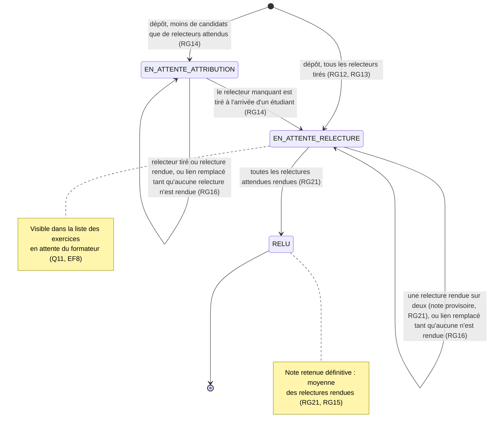

# D4 — Cycle de vie d'un exercice (version 2.2)

Les états correspondent à la colonne `exercice.statut` (D2). L'exercice attend `relecteurs_attendus` relecteurs : 2, ou 1 pour les exercices déposés avant l'étape 3 (RG22).

**Note provisoire (RG21) :** dès qu'une relecture est rendue, l'exercice a une note retenue, provisoire tant qu'il n'est pas RELU. C'est une information calculée, pas un état à part.

**Remplacement du lien (EF11, RG16) :** possible tant qu'aucune relecture n'est rendue et que la séance n'est pas clôturée. Il ne change pas l'état.

**Effet de la clôture (EF10, RG10, RG20) :** plus de remplacement de lien ni de nouvelle présence, donc plus d'attribution différée. Un exercice encore EN_ATTENTE_ATTRIBUTION y reste, visible du formateur. Une relecture déjà attribuée peut toujours être rendue.
