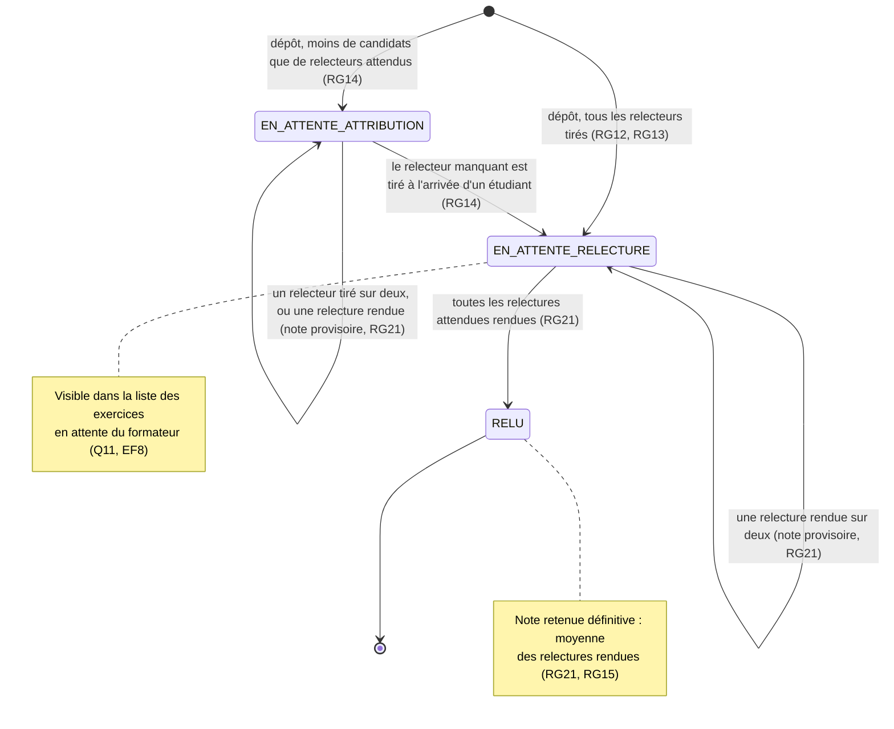

# D4 — Cycle de vie d'un exercice (version 2)

Les états correspondent à la colonne `exercice.statut` (D2). **Version 2 (étape 3) :** l'exercice attend `relecteurs_attendus` relecteurs, c'est-à-dire 2, ou 1 pour les exercices déposés avant le changement (RG22).

**Note provisoire (RG21) :** dès qu'une relecture est rendue, l'exercice a une note retenue, provisoire tant qu'il n'est pas RELU. Ce n'est pas un état à part : c'est une information calculée à partir du nombre de relectures rendues.

**Hors périmètre depuis l'étape 3 :** le remplacement du lien (EF11) et la clôture de session (EF10) ne figurent plus dans ce cycle de vie.
